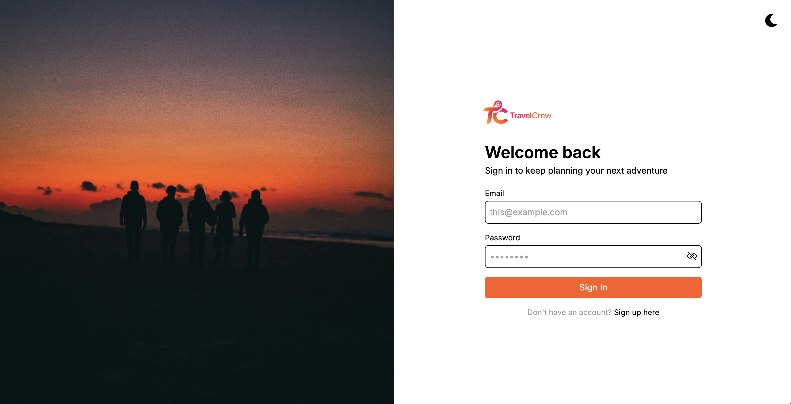
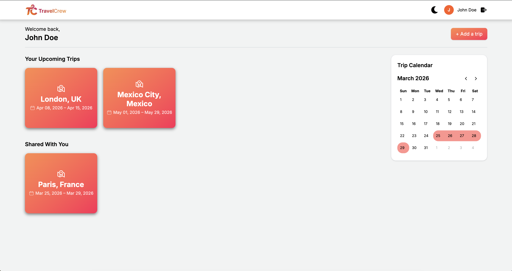
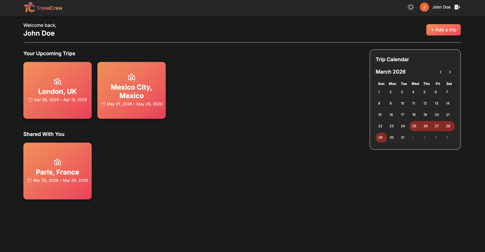
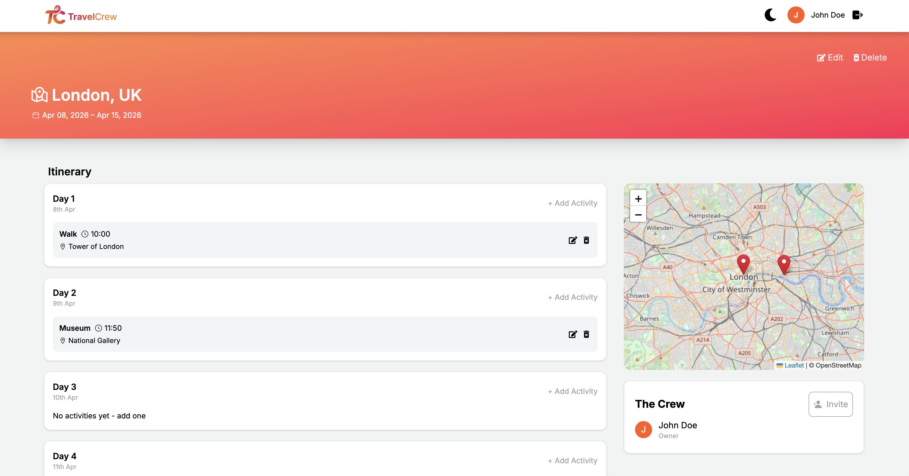

<h1 align="center">TravelCrew</h1>

<p align="center">
  Hello ! Welcome to our thesis project TravelCrew. It's a collaborative application for planning trips in groups. Everyone can participate in the process of organizing the trip.   
</p>

<p align="center">
  <a href="#demo">Demo</a> ·
  <a href="#features">Features</a> ·
  <a href="#tech-stack">Tech Stack</a> ·
  <a href="#getting-started">Getting Started</a>
</p>

## Demo

**Demo video:** [_YouTube Link_](https://youtu.be/jdrAwScpedk)

### Screenshot






## Features

- **Login/Signup:** Create an account and login to start planning your trips.  
- **Planner** Visualize your upcomings trips on the dashboard.  
- **Add/Edit/Delete a trip:** Add trips and modify them as you wish.
- **Add/Edit/Delete an activity:** Add and modify activities for each trip.
- **Invite collaborators:** Invite friends by email to plan trips together.

## Tech Stack

### Frontend

- **React** (UI)
- **Vite** (dev server & build)
- **Tailwind** (CSS Framework)
- **React Router** (Managing routing)
- **Flowbite React** (Dark/Light mode)
- **React Leaflet** (Map)
- **FullCalendar** (Calendar)

### Backend

- **Nodejs + Express** (REST API)
- **PostgreSQL + Sequelize** (Database/ORM)
- **Nodemailer** (Email invite service)
- **JWT** (Authentication)

## Getting Started

### Prerequisites

This project currently runs **locally only** 
To run it on your machine, you’ll need:

- **Node.js + PostgreSQL**

### Installation

Clone the repository, then install dependencies for both the client and server.

```
git clone <YOUR_REPO_URL>
cd <YOUR_REPO_NAME>
```

#### Install server dependencies

```
cd ../server
npm i 
```

#### Install dependencies

```
cd ../client
npm install
```

### Run Locally

#### 1) Start the backend

From the project root: 

```
cd server
npm run start

```

#### 2) Start the frontend

Open a new terminal, then from the project root:

```
cd client
npm run dev
```

#### Local URLs

- Frontend: `http://localhost:5173`
- Backend: `http://localhost:3000`


## Remaining Tasks

- [ ] **Deployment:** Make the app accessible to the public. 

## Project Context

Designed and developed as a team during the Codeworks Fullstack Bootcamp.

## The Development Team 

- Vitoria Lozado
- Ivan Georgiev 
- Sonia Lopez

## License  

MIT 


